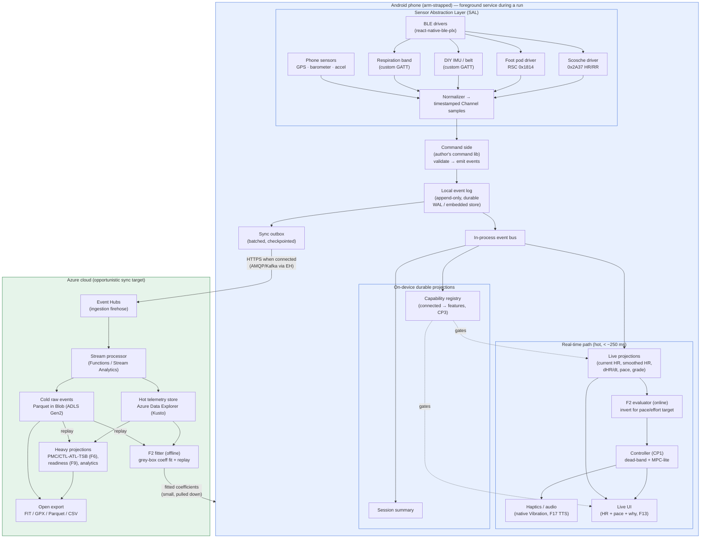
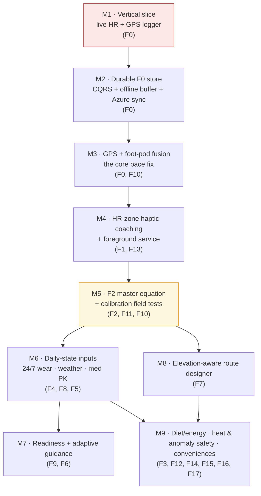

# Implementation plan

## 1. Overview & goals

`run` is a private, Android-first running coach for the author and a few friends. It turns heavy BLE sensor I/O (Scosche HR now; DIY foot-pod, breathing band, belt IMU later) into real-time, hands-free coaching and a long-lived, replayable record of every run. The architecture is event-sourced (CQRS) with an Azure cloud tier; the device is the system of record during a run, and the cloud is a downstream replica plus the heavy-compute tier.

This plan covers the full feature set **F0–F17** (see `/home/user/run/docs/features.md`) and is grounded in five prior-art research reports (`/home/user/run/docs/research/README.md`): **01** (F2 master equation, F3 burn), **02** (F5 medication PK), **03** (F6/F9/F11 adaptive training), **04/05** (F7 routing + elevation).

Goals, in priority order:

- **De-risk the spine first.** M1 is a fixed, thin vertical slice (BLE HR + GPS → event log → live HR/pace UI) that exercises every layer at once.
- **Make F0 real.** A durable, append-only, multi-channel timestamped event log on one clock is the substrate; every other feature is a projection of it.
- **Fix the founding complaint** — jumpy pace — via GPS + foot-pod fusion (M3).
- **Coach hands-free** with HR-zone haptics under an Android foreground service, screen off (M4).
- **Stand up the physiological core** — the invertible grey-box F2 model and calibration (M5) — then the daily-state inputs, readiness, routing, and the rest.

Cross-cutting principles carried throughout: **CP1** human-in-the-loop control (feedforward + feedback trim), **CP2** invertibility of F2, **CP3** capability gating (no synthetic fallback — features switch on/off by connected sensors), **CP4** grey-box modeling.

---

## 2. Target architecture

The design commits to *shapes and contracts* — the event log, the command side, projections, the sensor channel vocabulary, sync, the real-time path, and where F2 computes — and deliberately defers the language/runtime to §3. Every boundary is drawn so the same contract can be implemented in React/TS, F#/Fable, or a native module without redesign.

Anchor constraints:

- **F0 is the locked substrate:** append-only, timestamped, multi-channel sensor log; everything else is a projection.
- **Android-first, screen-off, arm-strapped:** the live path survives backgrounding via an Android **foreground service**; haptics fire without the UI.
- **Outdoor / poor connectivity:** capture is local-first for *reliability* — durable on-device buffer + opportunistic Azure sync. The network is never in the capture path.
- **CQRS** with the author's own command library on the write side; **projections are pure functions of the log** on the read side; **replay rebuilds projections** when a model changes.
- **F2 is invertible grey-box (CP2/CP4)** and runs in two modes: cheap on-device evaluation, heavy cloud-side fit/replay.
- **Capability gating, not graceful degradation (CP3).**

### 2.1 System / component view



**The device is the system of record during a run.** The local event log is authoritative and durable; Azure is a downstream replica plus the heavy-compute tier. This inverts the usual "cloud is truth" assumption because connectivity — not the phone — is the unreliable link.

### 2.2 Event-flow / CQRS view

```mermaid
sequenceDiagram
    autonumber
    participant S as Sensor (BLE)
    participant D as Driver (SAL)
    participant C as Command side
    participant L as Local log
    participant P as Live projection
    participant F as F2 online eval
    participant K as Controller (CP1)
    participant O as Haptics / Display
    participant OB as Outbox → Azure

    S->>D: 0x2A37 notify (HR [+RR])
    D->>D: decode + clock-anchor + quality-tag
    D->>C: ChannelSample(hr)
    C->>L: append event (fsync)
    L-->>P: event bus (in-process)
    P->>P: smooth HR, compute dHR/dt, pace, grade
    Note over P: grade from baro/map is instant; HR lags 10–30s
    P->>F: state vector (gated on required channels, CP3)
    F->>F: invert F2 for target pace / effort (feedforward from grade)
    F->>K: target + current
    K->>K: dead-band + min re-alert interval + MPC-lite lookahead
    K->>O: cue (speed-up / slow-down / in-zone) + "why" (F13)
    O-->>S: (runner adjusts — closes the human loop, CP1)
    L-->>OB: append-only tail → batch → ship when connected
```

Key properties of the write/read split:

| | Write side (commands → events) | Read side (projections) |
|---|---|---|
| Owns | The author's command-pattern library | Stack-agnostic projection functions |
| Input | Commands (intent) + normalized sensor samples | The event log |
| Output | Immutable events appended to the log | Materialized read models |
| Rate | Sensor events high (10s–100s Hz aggregate); commands rare | Live: every event. Durable: per-window / per-session |
| Rebuild | n/a (append-only) | **Replay the log** end-to-end |

The hard rule: **projections are pure, deterministic functions of the event log.** No projection holds state that isn't reconstructible by replay. That is what makes F2 versioning, "rebuild everything," and live/post-hoc coexistence tractable.

**Two event families share one ordered log:** (1) sensor events — normalized `ChannelSample`s, the firehose, never corrected in place (a correction event follows; the original stays); (2) domain commands → domain events — `StartRun`, `SetTargetZone`, `LogDose` (F5), `LogWeight` (F3), `SwapShoes` (F15), `RecordRPE`. Commands can be rejected; events cannot.

**Event envelope** (the load-bearing contract): `eventId` (UUIDv7, time-ordered), `streamId` (partition/aggregate), `seq` (per-stream monotonic — a gap = a known dropped sample), `type`, `t` (wall-clock ms, the join key), `deviceT` (pre-anchor source time), `schemaV` (every event self-describes its version; projections carry upcasters per `(type, schemaV)`), `payload`.

**Sensor Abstraction Layer (SAL).** Every driver — BLE GATT, phone sensor, custom ESP32 GATT — emits the same `ChannelSample` shape: `channel` (from the F0 vocabulary: `hr`, `rr`, `speed`, `cadence`, `grade`, `respRate`, `smo2`, `medConc`, `mass`, `accel`…), `value`, `unit`, `quality` (0–1), `deviceT`. A driver does exactly three things — transport+decode, clock-anchor once, quality-tag — and must **not** smooth, fuse, or interpret (that's projection work). A new sensor = a new driver mapping its bytes onto channel names; the log, command side, and projections never change. The **live vs. post-hoc** pattern generalizes the proven Scosche design: the live channel streams `0x2A37` (drops accepted); the authoritative post-hoc channel is the onboard **FIT** download (every beat, no BLE drops), imported as a driver emitting samples with the *same `streamId`*, higher `quality`, and a `correction` flag — the HRV projection prefers post-hoc; the live path used what it had.

**On-device buffering + sync.** The local log is durable (WAL-backed embedded store); a sample is acknowledged only once fsync'd. An **outbox** checkpointed by `seq` ships everything past the cursor to **Event Hubs** (partitioned by `streamId`), at-least-once, idempotent (cloud dedupes on `eventId`), batched and columnar-compressed. The buffer is sized for a worst-case zero-connectivity run.

**Cloud storage tiers (the `stack.md` decision, resolved): Azure Data Explorer (Kusto) for hot + Parquet-in-Blob (ADLS Gen2) for cold; Cosmos DB *not* chosen for the firehose.** ADX is the sweet spot for vast append-only timestamped telemetry with time-windowed queries (cardiac-drift windows, overnight rMSSD, segment GAP) and its KQL time-series operators directly serve F2/F6/F9; ingestion is cheap relative to Cosmos RU charges on high-frequency multi-stream writes — the explicit `stack.md` cost worry. Parquet-in-Blob is the cheap, immutable, open-format **canonical replayable copy** and the F0 export substrate (FIT/GPX/CSV derive from it). Cosmos remains reasonable only for small mutable read models / device sync state, never the firehose.

**Where F2 computes.** On-device: **evaluation only** — the model *form* (Minetti `Cr(i)` grade energetics clamped ±0.45, ACSM VO₂ baseline, CS/D′ reserve, invertible Hammerstein HR dynamics) is cheap to evaluate, runs offline in the hot loop, reads cached coefficients + live daily-state; mass and medConc rescale terms instantly with no refit. Cloud: **fitting + replay** — coefficient fitting (hierarchical population-priors → personal, MAP-Bayesian/MIPD for F5) runs in Azure over the replayed log + F11 tests, emits a small **versioned coefficient blob** the device pulls down. Change the model form → bump the version → replay Parquet → rebuild PMC/readiness/energy projections → ship new coefficients; the device never blocks.

---

## 3. The stack decision

This is the author's to decide. The architecture above is stack-agnostic by design, so this section lays out the tradeoffs crisply rather than dictating. The author framed three branches: **(1) React**, **(2) an F# solution** — in *two* flavors, Fabulous native and Fable+React — and **(3) an honest take on whether any other "killer" stack beats them.**

The single hardest axis for this app is **reliable backgrounded BLE with the screen off, phone on the arm**, on Android 12+ (foreground-service-type rules, Doze, and OEM battery killers on Xiaomi/Oppo/Vivo/Huawei). The second-hardest is **heavy on-device F2 compute** without janking the live UI. Weigh every option against those two first.

### 3.1 Comparison table

| Option | Fit score (/10) | BLE / mobile maturity | CQRS / ES / Azure fit | F# affinity | Key risk |
|---|---|---|---|---|---|
| **1. React + TypeScript on RN/Expo (incumbent)** | **8** | High — `react-native-ble-plx` v3.5.1 *installed*, Scosche work done, Expo config-plugin, New-Arch JSI | Good but indirect — native-TS ES (Emmett) is young; mature ES path (Marten/EventStoreDB) is .NET = second language. Azure via JS/.NET SDKs; buffer-and-POST sidesteps AMQP-in-RN | None (the explicit non-F# branch); only a separate F# backend is adjacent | Android background-BLE drops / OS killing the foreground service mid-run; heavy F2 on JS thread janking UI |
| **2a. F# native — Fabulous (MauiControls, MVU/Elmish)** | **5** | Backend strong; **UI weak** — Fabulous.MauiControls stable 8.0.5 (Jan 2024), .NET-8-only, ~23k downloads; Fabulous.Maui ON-HOLD. Plugin.BLE 3.2.1 mature, supports `connectedDevice` FG service | Excellent — DUs model events/commands; Marten/EventStoreDB + first-class Azure .NET SDKs; native-fast F2 | High — F# end-to-end incl. UI, units-of-measure, type-safe MVU. Leaks to C# interop at the Android platform boundary | Fabulous.MauiControls stalls / never ships stable .NET 9/10, stranding the UI; full rewrite throws away working RN + Scosche |
| **2b. F# via Fable (shared domain; UI = Fable+RN bindings or Feliz web)** | **4** | Backend/web healthy (Fable 5, Feliz, SAFE); **mobile abandoned** — `fable-react-native` last release 2018, predates Hermes/New-Arch/modern Expo. No F#/Fable BLE lib; conflicts with the Expo-v56 mandate | Best-in-class — single F# domain compiled to *both* .NET and JS; verbatim type sharing, no DTO drift; author already owns an F# command lib | Maximal — F# across domain, backend, model math, and UI logic; "uses React" via Fable | The make-or-break path (screen-off BLE) rests on a hand-rolled F#↔ble-plx bridge + a native FG service Fable can't abstract, on the least-supported foundation |
| **3. "Killer alternative" survey (native Kotlin the only real contender)** | **4** | Native Kotlin = gold standard (Nordic BLE libs, the reference every plugin wraps). Flutter's screen-off BLE scanning is a documented failure; KMP's Kable lags; .NET-mobile BLE thinnest | Stack-agnostic — ES is app code any of these express; author's command engine would be *reimplemented* in Kotlin | Poor-to-zero for Kotlin/Flutter/KMP; only the .NET branch respects F#, and that's the weakest-BLE branch | Full rewrite + re-porting the finished Scosche protocol for a *marginal*, possibly-redundant reliability gain (ble-plx wraps the same native APIs) |

### 3.2 Reasoned recommendation

**Recommendation: keep Option 1 (React + TypeScript on RN/Expo) as the build stack, and — if the author's F# interest is a real driver — carve out an optional F# slice for the parts where F# is strongest and the mobile weakness doesn't apply: the cloud CQRS/ES backend and the F2 fitter.**

The reasoning:

- **The incumbent already clears the two hardest bars well enough.** `react-native-ble-plx` is installed, the Scosche protocol work is done, and the library is itself a wrapper over the same native Android BLE APIs that native Kotlin would call directly. With a correctly written foreground service (`FOREGROUND_SERVICE_CONNECTED_DEVICE`), auto-reconnect (community-fork patterns), durable on-device buffering, and per-OEM battery-exemption prompts, screen-off BLE is achievable without leaving RN. Native Kotlin's edge here is **real but not decisive** — and it costs a full rewrite plus re-porting the protocol.
- **Both F# UI flavors fail on the part that is most of the work.** Fabulous rests on a lagging, lightly-maintained, .NET-8-only UI library whose successor is on-hold; Fable's RN binding layer has been abandoned since 2018 and conflicts head-on with the repo's hard Expo-v56 mandate. Picking either means the author near-solo-maintains the riskiest layer of the app. The prompt's own warning applies: do not boost a stack because the author likes the language when the language sits on the weakest mobile foundation.
- **Option 3 confirms there is no killer stack.** Every cross-platform alternative ends up needing native Android BLE for reliable screen-off operation, and the only F#-respecting alternative (.NET mobile) has the *thinnest* mobile-BLE maturity. So the honest answer to "does a killer stack beat them?" is **no.**
- **The hybrid honors the F# interest where it actually pays off.** The CQRS/ES write model and the compute-heavy F2 fit are F#'s home turf — discriminated unions for events/commands, exhaustive matching for fold/apply, units-of-measure for the physiology, native-fast numerics, and a mature .NET ecosystem (Marten/EventStoreDB + first-class Azure SDKs). Running these as an F# Azure Functions backend over the shared event log gives most of the F# upside with none of the mobile-UI risk. The device/UI/BLE layer stays TypeScript.

If the author values F#-end-to-end purity *over* shipping velocity and is willing to own the UI-layer maintenance risk, **Fabulous (2a)** is the more defensible of the two F# UI options (Plugin.BLE genuinely supports a `connectedDevice` foreground service, vs. Fable's abandoned bindings) — but that is a deliberate trade of risk for affinity, not the lower-risk path. **This is the author's call; the plan below stays valid whichever stack is chosen** because every milestone is expressed against the §2 contracts, and §5 calls out exactly where React and F# diverge.

---

## 4. Milestone roadmap

Sequenced strictly by dependency around the F0 event-sourced spine. M1 is fixed.

### 4.1 Milestone dependency graph



### 4.2 Milestones

**M1 — Vertical slice: live HR + GPS logger** *(fixed)*
- **Goal:** prove the end-to-end spine. Connect to the Scosche HR monitor and phone GPS, append both streams to the event store, render live HR + current pace. Nothing else.
- **Delivers:** F0.
- **Depends on:** —
- **Key deliverables:** BLE connect/subscribe to Scosche Rhythm 24 (`hr`+`rr` channels, protocol per `scosche-rhythm24.md`); `expo-location` GPS stream; F0 event store v0 (append-only, timestamped, multi-channel on one clock, on-device only); live HR + smoothed pace UI; minimal start/stop run control.
- **Risks/unknowns:** BLE reconnection during a moving run; raw GPS pace is jumpy (light smoothing here; real fix is M3); schema must generalize beyond two channels.

**M2 — Durable F0 store, session history, offline buffer + Azure sync**
- **Goal:** turn the M1 prototype log into the real F0 substrate — durable, replayable, exportable, with the author's CQRS command library on the write side and projections on the read side.
- **Delivers:** F0.
- **Depends on:** M1.
- **Key deliverables:** CQRS write side wired to the command library (`RunStarted`/`RunStopped`, future dose/shoe commands); read-side projection framework with log replay; session summary + history projection (first read model); durable on-device buffer surviving app kill / no connectivity; opportunistic sync to Event Hubs; tiered-storage decision implemented (ADX hot + Parquet-in-Blob cold — per §2); open-format export (FIT/GPX/Parquet/CSV).
- **Risks/unknowns:** confirm the offline-buffer requirement with the author (inferred, not explicitly stated); projection-replay performance as the log grows.

**M3 — GPS + foot-pod pace fusion (the core pace fix)**
- **Goal:** fix jumpy pace. Add the DIY foot-pod IMU (RSC `0x1814`: speed + cadence) as a new F0 channel and fuse with GPS for smooth, responsive, accurate pace. Establish CP3 and F10 groundwork.
- **Delivers:** F0, F10.
- **Depends on:** M2.
- **Key deliverables:** foot-pod RSC ingest as named channels; GPS+foot-pod fusion estimator (pod for responsiveness, GPS for absolute calibration / drift); capability gating (CP3) — pod metrics only when connected, no synthetic fallback; improved live pace + cadence; running-power groundwork from IMU + grade (research/01 §6).
- **Risks/unknowns:** DIY foot-pod firmware/RSC output must exist and be validated (`hardware.md`); pod-vs-GPS scale-factor auto-calibration; confirm `expo-sensors` barometer support on Android for live grade.

**M4 — HR-zone haptic coaching + foreground service**
- **Goal:** hands-free live coaching — vibrate to hold a target HR zone, screen off, app backgrounded, phone on the arm. Implements the CP1 control loop and F13 transparency.
- **Delivers:** F1, F13.
- **Depends on:** M3.
- **Key deliverables:** Android foreground service keeping logging + haptics alive screen-off; %HRR (Karvonen) target zone (research/01 §9); distinct vibration patterns (speed-up / slow-down / in-zone silence / stronger for way-out); control-loop cueing (smoothed HR + rate-of-change, dead-band, min re-alert interval — avoid chasing HR lag); F13 "why" surface ("over zone by N bpm").
- **Risks/unknowns:** `expo-haptics` is preset-only — rich patterns may need native Vibration API (verify against Expo v56); foreground-service config under Expo (config plugin / native module), battery/Doze behavior; patterns must be distinguishable through a sleeve.

**M5 — F2 master equation + calibration field tests** *(keystone)*
- **Goal:** stand up the physiological core — a grey-box, fully-invertible (CP2) personal model fitted from the clean data now flowing into F0, plus the calibration tests that anchor it.
- **Delivers:** F2, F11, F10.
- **Depends on:** M4.
- **Key deliverables:** F2 grey-box model (~5 coefficients: CS, D′, running economy, HRmax, RHR + one HR time-constant; mass a scalar input, not a coefficient); concrete blocks from research/01 (Minetti `Cr(i)` clamped ±0.45 + GAP, ACSM VO₂ baseline, CS/D′ 2-param, invertible Hammerstein HR dynamics); invertibility (CP2) — solve pace↔HR↔effort; HR-VO₂-calibrated calorie burn (F3 burn side); F11 calibration field tests + Riegel predictor byproduct; hierarchical fitting (population priors → individual; sensor-light friends run on priors with wide uncertainty); F10 running power finalized as F2-linked + optional haptic power zone.
- **Risks/unknowns:** where the fit runs (on-device vs Azure replay — compute-heavy; plan says cloud); open modeling items (single vs two-time-constant HR, GAP speed-dependence, per-user heat sensitivity); needs enough logged runs + ≥1 calibration test before estimates are trustworthy.

**M6 — Daily-state inputs: 24/7 wear, weather, medication PK**
- **Goal:** capture the *measured daily-state inputs* (distinct from slow fitness coefficients) that F2 takes as covariates and F9 consumes.
- **Delivers:** F4, F8, F5.
- **Depends on:** M5.
- **Key deliverables:** F4 — RHR, observed-vs-formula max HR (labeled), overnight HRV (rMSSD from RR), rough sleep timing via onboard FIT + periodic background sync (not 24/7 streaming); F8 — auto-ingest weather with temperature and humidity as **separate** channels (wet-bulb/WBGT), wind/AQI optional; F5 — medication log + one-compartment PK `C(t)` with multi-dose superposition, MAP-Bayesian/MIPD personalization (research/02), honest "estimate not measurement" UI, wired into F2 as a covariate modulating the resting/arousal term (offset, not slope).
- **Risks/unknowns:** Scosche onboard-storage-full behavior + 24/7 HRV battery cost (open in `scosche-rhythm24.md`); medication privacy/storage + which formulation(s); weather API choice and timestamp backfill alignment.

**M7 — Readiness score + adaptive training guidance**
- **Goal:** close the human-in-the-loop training loop — a daily readiness number that decides each session day-of, rejecting the frozen-calendar model.
- **Delivers:** F9, F6.
- **Depends on:** M6.
- **Key deliverables:** F9 readiness from overnight HRV + RHR + sleep (F4) + recent load + med state (F5), smoothed against single-day noise (research/03); F6 load engine — PMC (CTL/ATL/TSB, Banister) as projections, ACWR as soft warning only, load via TRIMP / TSS-rTSS / session-RPE; rolling-horizon planner (goal-anchored skeleton + day-of commitment, auto-regulated by readiness); intensity distribution exposed as a choice (not hard-coded 80/20), deterministic pace zones (no ML); planner as rule/template engine with optional LLM-with-hard-guardrails layer.
- **Risks/unknowns:** cold start before enough personal data (lean on population rules); goal-race structure vs day-of flexibility tension; if LLM planner used, follow the `claude-api` skill and enforce hard guardrails.

**M8 — Elevation-aware route designer**
- **Goal:** generate hill-aware routes within a home radius with road-level preferences, using F2+GAP to predict pace/effort/time per route. Branches off M5; otherwise an independent backend track.
- **Delivers:** F7.
- **Depends on:** M5.
- **Key deliverables:** self-hosted GraphHopper core (native round-trip + slope-aware weighting, research/04); two modes (find-flat slope-weighted graph; account-for-hills profile + F2/GAP expected pace/effort/time, optional distance adjustment to match session effort); road preferences as per-road weights (persist OSM way ID + geometry; tap-to-way snapping); elevation via USGS 3DEP (COG DEMs on AWS for route profiles, EPQS for points; barometer for live grade); OSM surface/highway/foot tags for run-quality weighting; rank candidate loops; round-trip geometric heuristic (don't solve exact NP-hard loop).
- **Risks/unknowns:** hosting/ops for GraphHopper + OSM extracts + DEM tiles; effort-matched distance depends on a well-calibrated F2; 3DEP 1 m coverage gaps.

**M9 — Diet/energy balance, heat & anomaly safety, conveniences**
- **Goal:** round out tracking/physiology + convenience surface now that F2 (burn), F5 (med conc), F8 (WBGT) and the sensor suite exist.
- **Delivers:** F3, F12, F14, F15, F16, F17.
- **Depends on:** M6, M8.
- **Key deliverables:** F3 — photo food logging via a vision model (`claude-api` skill) with portion confirm/adjust; energy-balance ledger (intake − Mifflin-St Jeor BMR − activity − F2 run burn) as a trend; F12 — heat-safety advisor (WBGT/humidity + med conc + Physiological Strain Index, research/01 §8; tailored to amphetamine thermoregulation risk; informational); F14 — RR-stream anomaly flags (irregular beats, RHR spikes; informational, not diagnostic); F17 — audio coaching (voice splits/pace/"ease off"); F15 — auto shoe-mileage tracking (foot-pod auto-detect + replacement warning); F16 — locomotor-respiratory coupling once the breathing band exists.
- **Risks/unknowns:** food-photo portion accuracy + photo/body-metric privacy; F3 first-class vs companion app (open in `features.md`); F16 depends on the DIY breathing band existing (`hardware.md`).

---

## 5. M1 in detail

M1 is the thin vertical slice: **BLE HR connect → GPS → event-store write → live HR + pace UI.** It must work on the chosen stack and stay valid across stacks. Tasks below note where **React/TS** and **F#** diverge; everything else is shared. Most of M1 is stack-shaped at the *edges* (native BLE/location/UI bindings) and stack-agnostic in the *middle* (the event log and channel contract from §2).

### 5.1 Task breakdown

**T1 — Custom dev build / app shell.**
A run-able Android app shell with start/stop navigation. This is *not* Expo Go (BLE needs a custom dev build via `expo prebuild`).
- *React:* Expo SDK 56 / RN 0.85 (already scaffolded); add the `@config-plugins/react-native-ble-plx` plugin (pin the latest to avoid the SDK-56 config-evaluation bug, dotintent #1339); `expo prebuild`; EAS/local dev build.
- *F#:* a Fabulous.MauiControls (.NET 8) Android project, or — if hybrid — keep the RN shell and add an F# Azure backend later. No prebuild; instead the MAUI Android build chain.

**T2 — BLE HR driver (SAL, `hr`+`rr` channels).**
Scan → connect → subscribe to `0x2A37` HR notifications; decode HR (and RR if present), clock-anchor once (`offset = host_time − device_time` on first sample), quality-tag from RSSI/drop rate; emit `ChannelSample`s. Reuse the finished Scosche protocol.
- *React:* `react-native-ble-plx` (v3.5.1, installed); `monitorCharacteristicForService` → callback → normalizer. Consider `react-native-worklets` (installed) for off-JS-thread decode if needed.
- *F#:* `Plugin.BLE` 3.2.1 GATT notify → marshal onto the MVU dispatch loop. (Fable flavor would hand-write `[<Import>]/[<Emit>]` bindings over `react-native-ble-plx` — bespoke, untyped at the boundary; a reason this flavor is not recommended.)

**T3 — GPS driver (SAL, `speed`/`location` channel).**
Foreground location stream → normalized samples on the same clock as T2; light smoothing so pace isn't raw-GPS-jumpy.
- *React:* `expo-location` watch with a suitable accuracy/interval; verify foreground behavior against v56 docs.
- *F#:* MAUI `Geolocation` / platform `LocationManager` via interop.

**T4 — Event store v0 (stack-agnostic core).**
Append-only, timestamped, multi-channel log on one clock, implementing the §2.3 envelope (`eventId`/`streamId`/`seq`/`type`/`t`/`schemaV`/`payload`). Single `streamId` per run; per-stream `seq` for gap detection. On-device only at M1; designed to generalize beyond two channels (do **not** hardcode HR+GPS).
- *Shared:* the channel vocabulary and envelope are identical across stacks — this is the seam that keeps the plan valid either way.
- *React:* `expo-sqlite`/`op-sqlite` append-only table (WAL), or a minimal hand-rolled log; TS event/command types.
- *F#:* local SQLite/LiteDB journal; events as discriminated unions (the natural fit). The author's command library can already shape `RunStarted`/`RunStopped` here if desired.

**T5 — Live projection + reactive UI.**
In-process bus delivers each appended event to a live projection computing current HR, smoothed HR, and smoothed pace; UI renders HR + pace and updates at display rates.
- *React:* BLE/GPS sample → app state/store → React render. Smooth at 1 Hz; React handles HR/pace update rates comfortably.
- *F#:* MVU/Elmish — `update` folds sensor messages into the model; `view` renders. Conceptually the same unidirectional flow as React/Redux, type-safe end to end.

**T6 — Run control (bound a session).**
Start/stop emits `RunStarted`/`RunStopped` commands (rare domain events) that open/close the `streamId`, so a run is a well-bounded event session. Shared across stacks; differs only in command-library wiring (TS module vs F# command lib).

**T7 — On-device validation.**
Real-hardware smoke test: HR connects and streams, GPS produces a moving pace, both land in the log with monotonic `seq` and a shared clock, and the UI is live. Catch BLE reconnection and GPS-jumpiness behavior here (full fixes are M3). Stack-agnostic acceptance; the harness differs (RN dev build vs MAUI build).

### 5.2 What explicitly differs by stack (summary)

| M1 task | React/TS | F# (Fabulous primary; Fable noted) |
|---|---|---|
| T1 shell/build | Expo prebuild + ble-plx config plugin (pin latest) | MAUI Android project (Fabulous) / RN shell if hybrid |
| T2 BLE driver | `react-native-ble-plx` (installed, Scosche done) | `Plugin.BLE` 3.2.1 / hand-rolled Fable interop |
| T3 GPS | `expo-location` | MAUI `Geolocation` / `LocationManager` interop |
| T4 event store | `expo-sqlite`/`op-sqlite`, TS types | SQLite/LiteDB, F# DU events |
| T5 UI | React render from store | MVU/Elmish `update`/`view` |
| T6 run control | TS command module | author's F# command lib |

**Shared regardless of stack:** the event envelope, the `ChannelSample` channel vocabulary, the one-clock anchoring rule, the single-`streamId`-per-run model, and the append-then-react ordering. Keeping these stack-agnostic is exactly what lets the stack decision (§3) stay open through M1.

---

## 6. Open decisions & risks

**Open decisions (author's to make):**

1. **The stack (§3).** React-incumbent (recommended), an F# UI flavor (affinity over velocity, with maintenance risk), or the recommended hybrid (TS device + F# backend/F2 fitter). Decide before M2 hardens the write side, since the command-library binding differs.
2. **Native-TS vs .NET event store.** If React: Emmett (young, not fully production-mature) / hand-rolled SQLite log vs a separate .NET (Marten/EventStoreDB) backend — the latter reintroduces a second language. For a private app, a hand-rolled or Emmett-based log is plausibly enough.
3. **ADX vs Cosmos for the hot tier.** Plan recommends **ADX (Kusto) + Parquet-in-Blob**, Cosmos rejected for the firehose on RU cost — confirm against actual projected volume/budget at M2.
4. **Offline buffer + sync scope.** Flagged as an *inferred* (not explicitly stated) requirement — confirm with the author at M2.
5. **Where the F2 fit runs.** Plan says cloud (replay over Parquet/ADX); revisit if on-device fitting ever becomes desirable.
6. **F2 modeling specifics.** Single vs two-time-constant HR; GAP speed-dependence; per-user heat sensitivity — resolve empirically during M5.
7. **F3 surface** — first-class feature vs companion app (open in `features.md`).
8. **LLM planner (M7) / vision food-logging (M9)** — if used, follow the `claude-api` skill and enforce hard guardrails.

**Top risks (with mitigations):**

1. **Android background BLE drops / OS killing the foreground service mid-run** (Doze, OEM battery managers; ble-plx history #127/#217/#484/#812/#1177). The dominant operational risk on any stack. *Mitigate:* durable on-device buffering (a sample is logged before it drives the UI), robust foreground-service notification, auto-reconnect (community-fork patterns), per-OEM battery-exemption prompts. Validate on real arm-strapped hardware.
2. **Heavy F2 compute escaping the 16 ms frame budget and freezing the UI.** *Mitigate:* on-device runs **evaluation only**; fitting is cloud-side; push the control loop to a worklet/native module from the start (don't retrofit). RN: `react-native-worklets` (installed). F#: native-fast .NET.
3. **Haptics fidelity.** `expo-haptics` is preset-only; distinguishable F1 patterns need the native Vibration API. *Mitigate:* verify against Expo v56 and test through a sleeve early (M4).
4. **Expo SDK-56 + ble-plx config-plugin evaluation bug (dotintent #1339).** *Mitigate:* pin/verify the latest plugin before relying on prebuild (M1/T1).
5. **DIY hardware availability.** Foot-pod (M3) and breathing band (M16/M9) must physically exist with validated output (`hardware.md`) before their milestones can complete.
6. **F# UI-layer maintenance** (if chosen). Fabulous.MauiControls lagging / Fable RN bindings abandoned — near-solo maintenance of the riskiest layer. *Mitigate:* prefer the hybrid (F# backend only) unless affinity is the explicit priority.
7. **Upstream churn.** Expo ships yearly breaking changes (per `AGENTS.md`); ongoing upgrade maintenance for a long-lived personal project. *Mitigate:* pin versions, read the exact versioned v56 docs before writing code, keep the native surface small.

---

*Sources grounding this plan: `/home/user/run/docs/features.md`, `/home/user/run/docs/stack.md`, `/home/user/run/docs/scosche-rhythm24.md`, `/home/user/run/docs/research/README.md` (reports 01–05), `/home/user/run/package.json`.*
